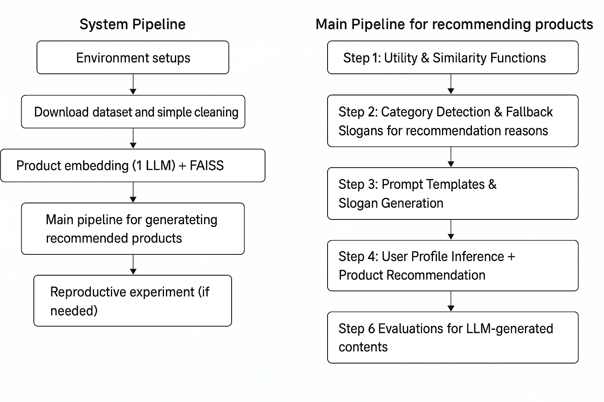
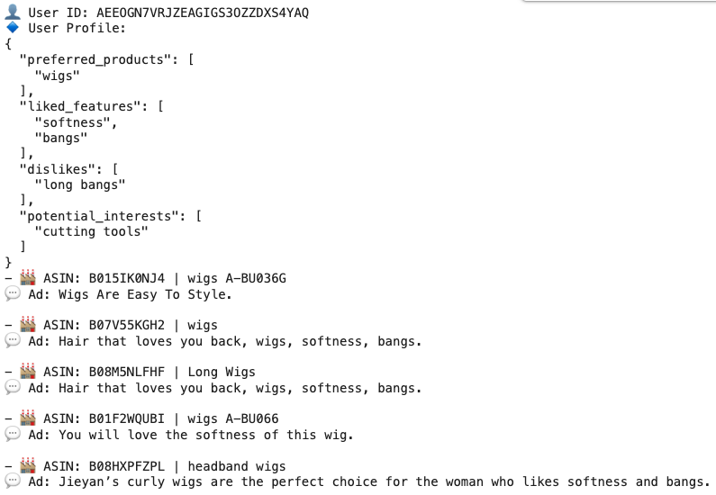

# 📌 LLM-Based Product Recommender

**Description**  
Developed an end-to-end recommendation system powered by LLMs for Amazon product reviews. The system embeds product metadata and review content using Flan-T5 and MiniLM, then computes similarity via Faiss for real-time Top-N recommendations. Personalized ad-style reasons are generated using prompt chaining based on extracted user preferences.

**Key Technologies**  
- `Flan-T5` for review summarization and recommendation slogan generation  
- `MiniLM` and `BGE-small` for product embedding  
- `FAISS` for fast nearest-neighbor retrieval  
- `Prompt Engineering` for profile inference and ad reasoning  
- `Streamlit`, `Pandas`, `Scikit-learn` for UI prototyping and pipeline construction

**Highlights**  
- Indexed 50K+ beauty product reviews for semantic recommendation  
- Built modular LLM-based pipelines for both cold-start and profile-rich users  
- Integrated multi-stage filtering and re-ranking for relevance and diversity  
- Evaluated with semantic similarity, diversity, and output specificity metrics  
- Optimized for local GPU setup (≤8GB) with mixed lightweight and 7B models

---

## 🔁 System Overview

---

## 🧠 Core Inference Pipeline

---

## 🧾 Selected Outputs

> “Hair that loves you back — wigs, softness, bangs.”  
> “You will love the softness of this wig.”

---

## 📊 Evaluation Snapshot

| Metric                  | Score (non-cold start) |
|-------------------------|------------------------|
| Semantic Match (CosSim) | 71.8%                  |
| Ad Diversity            | 82.6%                  |
| Avg. Product Rating     | 4.31                   |

---

📁 Full report: [ST446_Project.pdf](./4%20Report/ST446_Project.pdf)
